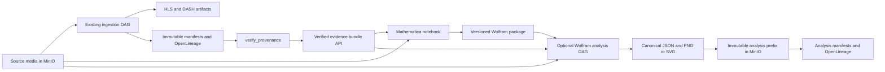
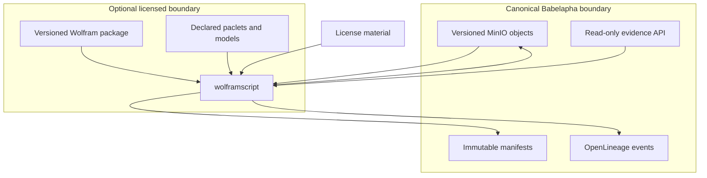

# Target architecture

## Boundary

Wolfram is a consumer of verified Babelapha artifacts and a producer of new
derived artifacts. It is not the ingestion orchestrator, media store, lineage
authority, or transcoder.



## Why a separate DAG

The shipped ingestion DAGs have explicit task contracts and finish with a
provenance gate. Adding Wolfram to `ingest_pipeline_local` would change the
meaning of a successful ingestion and make it depend on a licensed engine.

The future `analyze_media_wolfram` DAG should therefore:

1. accept an object ID and a verified ingestion run ID;
2. fetch and independently verify the corresponding evidence bundle with
   Babelapha's existing standard-library Python verifier;
3. resolve the source artifact by immutable URI/version and SHA-256;
4. execute the versioned Wolfram package headlessly;
5. validate the result contract;
6. upload portable result artifacts to MinIO;
7. record one immutable manifest and OpenLineage event per task attempt; and
8. end with its own `verify_provenance` gate.

The DAG is opt-in and may fail without changing the status of the ingestion
run it analyzes.

## Data flow and storage

Proposed output namespace:

```text
analysis/wolfram/<object-id>/<analysis-id>/<analysis-run-id>/
  result.json
  audio-overview.png
  audio-overview.svg
```

Proposed immutable provenance namespace follows the existing convention:

```text
provenance/<object-id>/<analysis-run-id>/<task-id>/<attempt>-<status>.json
```

`analysis-id` identifies the analysis contract and method version, while
`analysis-run-id` identifies one Airflow execution. Mutable convenience reports
must not become the source of truth.

## Processor evidence interface

This branch adds a strict JSON task-payload interface for processor identity:

```json
{
  "provenance_parameters": {
    "analysis_id": "audio-provenance-diagnostic-v1",
    "processor": {
      "name": "wolfram",
      "kernel_version": "15.0.1",
      "system_id": "Linux-x86-64",
      "package_sha256": "<sha256>",
      "network_mode": "offline",
      "evaluator_backend": "<declared backend>"
    },
    "resources": []
  }
}
```

These values are copied into the immutable manifest's
`execution.parameters` and its OpenLineage execution facet. They must be
strict JSON values. Babelapha rejects attempts to override object, source
commit, DAG-bundle, Git-identity, or pipeline-task-contract facts.
The eventual task adapter must allowlist its fields and must not place license
credentials, tokens, or other secrets in provenance parameters.

## Trust and dependency boundaries



- License material is a runtime secret. It must never be embedded in an image,
  committed, logged, stored in a result, or returned by the evidence API.
- Network access is denied by default for a reproducibility run. Any cloud or
  external-service experiment is a separate processor with explicit approval
  and evidence.
- The official Wolfram image must be pinned by digest for a provenance-bearing
  run. A floating `latest` tag is unsuitable evidence.
- A notebook may call the package, but production results come from the
  headless entry point and the validated JSON contract.
- Version 15 `Tabular`, `TimeSeries`, and `EventSeries` objects are internal
  analysis representations. They never replace the evidence bundle or become
  required to inspect a published result.
- A future Wolfram MCP server is a read-only client of the same versioned
  analysis functions. It cannot bypass the evidence API or obtain write access
  to Airflow or MinIO.

## Failure behavior

| Failure | Required behavior |
|---|---|
| Existing Python verifier rejects the evidence bundle | Fail before Wolfram execution and record no successful outputs |
| Source hash or storage version differs | Fail as an integrity conflict |
| License unavailable or expired | Fail the optional DAG with a specific reason code; ingestion remains successful |
| Required paclet/model unavailable | Fail closed and identify the missing dependency |
| Undeclared network access required | Fail the reproducibility run |
| Invalid JSON result | Do not publish derived artifacts as successful |
| Partial upload | Record only verified uploaded artifacts; retry idempotently under the same analysis run |
| Provenance emission incomplete | Final analysis gate fails even if computation succeeded |
