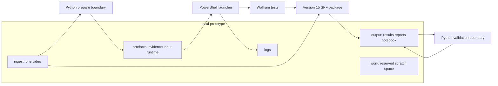
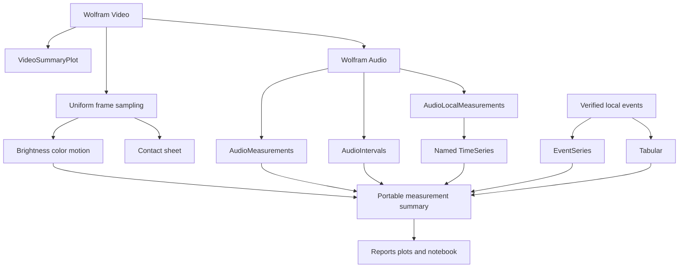
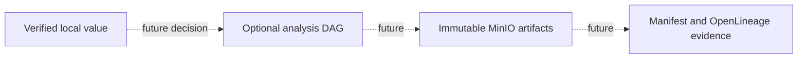

# Local Wolfram-first architecture

## Implemented system boundary

The current system is a self-contained local research workflow. Mathematica is
the media and analytical engine; Python is the narrow trust boundary around
its inputs and outputs. Airflow and MinIO are not involved in this path.



The launcher is
[`scripts/Invoke-MathematicaLocalPrototype.ps1`](../../scripts/Invoke-MathematicaLocalPrototype.ps1).
It discovers registered installations, probes candidates through
`wolframscript -local`, requires a working Wolfram Language 15-or-newer kernel,
and records the exact selected runtime. The reference run used Engine 15.0.0;
the architecture does not assume a particular patch version.

## Responsibility split

| Component | Owns | Does not own |
|---|---|---|
| PowerShell launcher | Runtime discovery, exact kernel selection, ordering, logs, completion checks | Media calculations or result interpretation |
| Python boundary | Byte identity, local evidence, strict JSON, safe paths, artifact rehashing, canonicalization | Audio/video measurements, plots, reports, or notebook calculations |
| Wolfram package | Video/audio import, analysis, `TimeSeries`, `EventSeries`, `Tabular`, visualization, reports, notebook | Canonical JSON trust decision or remote publication |

This split ensures that every human-facing analytical artifact is genuinely
produced by Mathematica while portable identity and contract enforcement do
not depend on trusting Mathematica's serialization alone.

## Analysis graph



The internal Wolfram objects are not interchange formats. Their stable
measurements and structural summaries cross the boundary as JSON, while the
notebook preserves a native Mathematica review experience.

## Local storage contract

```text
Local-prototype/
  ingest/<one-video>
  artefacts/source-evidence.json
  artefacts/analysis-input.json
  artefacts/runtime.json
  output/result.raw.json
  output/result.json
  output/audio-overview.png
  output/audio-overview.svg
  output/video-contact-sheet.png
  output/video-summary.png
  output/report.md
  output/report.html
  output/analysis-notebook.nb
  logs/mathematica-local-<UTC timestamp>.log
  work/
```

Inputs and generated material stay local and are ignored by Git. Paths inside
the JSON contracts are safe relative paths; absolute local machine paths are
limited to the runtime record and launcher output.

## Trust and failure boundaries

The prepare boundary hashes the user-selected source and creates a canonical
local evidence document. It also computes the complete Wolfram package hash
and binds it into both the analysis input and deterministic run ID. Mathematica
independently recomputes that package identity and verifies source byte size,
source SHA-256, evidence SHA-256, and evidence/source identity before opening
the video. The validation boundary permits no undeclared result fields or
outputs, recomputes the current package hash, and recomputes every declared
output identity. Preparing a new valid run removes prior canonical/raw result
markers so a failed rerun cannot look successful.

The package uses Structured Package Format and typed exceptions so callers can
distinguish usage, invalid input, integrity, dependency, and analysis/export
failures. Credentials and license material are never written to evidence,
results, reports, or logs.

## Deferred production topology

An optional Airflow/MinIO analysis path is intentionally deferred. It is not a
hidden requirement of the local runner and is not represented as implemented.
If adopted later, it must remain a separately triggered analysis workflow,
reuse the versioned result contract, run Wolfram in an isolated licensed
runtime, record immutable processor/artifact identities, and leave ingestion
success independent of Wolfram availability.


