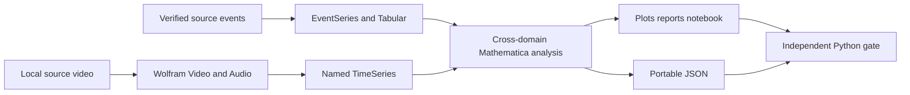
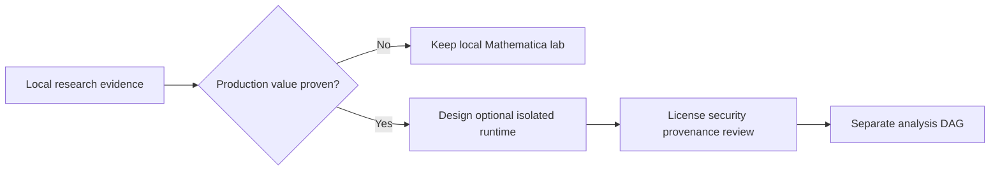

# Mathematica leverage roadmap

## Direction

Exhaust the analytical and authoring value of Mathematica locally before
introducing orchestration, storage, or cloud complexity. The implemented local
media lab is the foundation; Python remains only the independent trust boundary.

## Foundation — implemented and verified

The current branch now provides:

- the `Local-prototype/{ingest,artefacts,output,logs,work}` workspace;
- one-command local execution through
  `scripts/Invoke-MathematicaLocalPrototype.ps1`;
- explicit discovery and recording of an exact Wolfram Language 15+ kernel;
- a Structured Package Format package with registered typed exceptions;
- direct Wolfram `Video` and `Audio` import and analysis;
- frame/color/motion, loudness, interval, and spectral measurements;
- named `TimeSeries`, provenance `EventSeries`, and `Tabular` representations;
- seven hashed Wolfram outputs, including HTML/Markdown reports and a notebook;
- strict Python input/evidence preparation and output canonicalization only;
- independent package-hash binding and an optional two-run repeatability gate;
- Wolfram unit tests, Python boundary tests, repeatable audio/video execution,
  and a successful no-audio fallback run on Engine 15.0.0 for Windows x86-64.

## Next — deepen local Mathematica use

Add experiments as separate, versioned analyses rather than optional switches
inside the existing result contract.

1. **Video dynamics:** extend sampled-frame analysis with feature tracking,
   stabilization diagnostics, scene/shot structure, richer motion fields, and
   comparative visual summaries.
2. **Audio structure:** add frequency-band energy, pitch/harmonic analysis,
   transient and silence segmentation, channel comparisons, and interactive
   interval inspection in the notebook.
3. **Cross-modal alignment:** align frame and audio measurements on shared time
   axes and use Wolfram temporal objects to identify correlated changes.
4. **Statistical explanation:** use symbolic/statistical models and
   `ModelFitReport` where they improve interpretation, while recording model
   definitions and producing portable coefficient/diagnostic summaries.
5. **Provenance exploration:** turn richer local evidence into graph and
   temporal views without replacing canonical source/evidence JSON.
6. **Notebook research surface:** make the generated notebook the inspectable
   local lab for drilling into measurements and rerunning the shared package;
   production calculations must stay in package code.
7. **Transcript/text research:** only after a canonical local transcript exists,
   evaluate temporal alignment, entity/text analysis, and semantic retrieval as
   explicitly identified processors.

Every experiment must identify its input bytes, exact kernel and package hash,
parameters, outputs, and capabilities used. Cloud functions, implicit model
downloads, LLM calls, and speech services remain off unless introduced as a
separate, reviewable experiment.

## Local adoption gates

A local experiment graduates into the shared package only when:

- it adds a clear analytical or explanatory capability;
- reruns use the same package path as the generated notebook;
- outputs are portable and independently hash-verifiable;
- failures are typed and no partial result is canonicalized;
- a new wire shape receives a new schema/analysis version;
- the exact Wolfram runtime and dependencies are recorded.

## Deferred — operational integration

Airflow scheduling, MinIO publication, container images, OpenLineage emission,
MCP serving, and unattended licensing are future decisions, not work required
for the current local lab. If local evidence later justifies productionization,
the first operational step is a separately triggered optional analysis DAG;
Wolfram must never become a prerequisite for successful ingestion.

