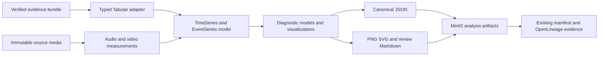
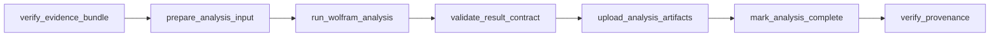

# Mathematica leverage roadmap

## Goal

Use Mathematica where its current capabilities create a distinct research or
explanatory advantage, while preserving Babelapha's portable artifacts,
Airflow control plane, immutable provenance, and Python verification boundary.

## Phase 1 — Version 15 local spike

Purpose: prove that current Wolfram features improve the existing
audio/provenance pilot before introducing Airflow or container complexity.

Deliverables:

- a Version 15 Structured Package Format package;
- typed exceptions mapped to documented exit codes and reason codes;
- an evidence adapter that converts a verifier-approved bundle to `Tabular`;
- named `TimeSeries` components for audio measurements;
- an `EventSeries` representation of task attempts and decisions;
- canonical `result.json`, PNG/SVG plots, and optional Markdown review export;
- Wolfram unit tests and a Python contract verifier;
- the equivalent Python baseline from the existing pilot design.

Exit gate: repeatable headless results, notebook/headless parity, portable
outputs, and a measurable advantage over Python. No cloud, LLM, speech service,
MCP, or production license is required for this pre-production spike.

## Phase 2 — Optional Airflow analysis DAG

Purpose: prove operational fit without changing ingestion success semantics.

Proposed task contract:

Requirements:

- a separately triggered `analyze_media_wolfram` DAG;
- an exact Wolfram kernel version and runtime image digest;
- offline resource inventory and runtime network denial;
- a license preflight before work is accepted;
- an Airflow pool matching permitted kernel concurrency;
- immutable result, visualization, verifier, code, and dependency identities;
- no change to the successful status of the source ingestion run.

Exit gate: the complete analysis task contract passes the same immutable
manifest/OpenLineage verification standard as shipped ingestion DAGs.

The branch already supplies the bounded `provenance_parameters` path needed to
carry processor-specific facts into manifests and OpenLineage. Remaining
integration prerequisites are:

- preserve an allowlisted typed failure reason from the Wolfram adapter rather
  than reducing every failed callback to `TASK_FAILED`;
- construct the evidence-bundle URL from validated object/run identifiers
  inside the DAG rather than accept an arbitrary user URL;
- validate and canonicalize raw Wolfram JSON in Python before publication;
- add the new DAG to `PIPELINE_TASK_CONTRACTS` only when all tasks exist;
- run Wolfram in a separate runtime because the Airflow image intentionally
  contains no Wolfram Engine.

## Phase 3 — Media and transcript research

Purpose: use the newer multimodal and semantic capabilities only where the
underlying canonical artifacts exist.

Candidate experiments, in order:

1. sampled-frame stability and feature-motion analysis using Version 14.3+
   video functions;
2. speaker/speech interval research with explicitly identified local or
   external processors;
3. transcript `Tabular`/`EventSeries` alignment with media timestamps;
4. semantic search and reranking over canonical transcript segments;
5. `ModelFitReport` diagnostics for pipeline latency and media-quality trends.

Each experiment gets its own `analysis_id`, result contract, dependency
inventory, Python comparator, and adoption decision. Do not grow one generic
analysis stage with hidden optional behavior.

## Phase 4 — Read-only MCP exploration

Purpose: let an AI client ask bounded computational questions over verified
evidence without granting it pipeline authority.

The MCP surface is limited to pure/read-only tools. Every response includes
the object ID, run ID, evidence-set SHA-256, analysis version, and source URIs.
No tool can trigger ingestion, modify MinIO, change an Airflow run, publish an
artifact, or assert an unverified interpretation as canonical fact.

Exit gate: threat review, authentication, rate/resource limits, audit logging,
prompt-injection tests, and proof that the same answer can be reproduced by a
direct non-MCP call to the underlying versioned function.

## Phase 5 — Production packaging decision

Choose one deployment model only after the preceding phases provide measured
usage and concurrency:

- licensed Wolfram Engine container invoked by Airflow;
- an on-demand licensed engine where network and cost are acceptable;
- a commercially licensed standalone application;
- no Wolfram runtime in production, with validated methods promoted to Python.

The decision record must include licensing confirmation, activation mode,
runtime footprint, cold/warm timings, concurrency, recovery behavior, upgrade
policy, and an exit/migration path.

## Branch acceptance criteria

This branch is ready to merge when:

- current-version claims cite official Wolfram sources;
- new features are mapped to concrete Babelapha inputs and outputs;
- experimental AI/MCP work is separated from deterministic analysis;
- the existing pilot and architecture documents reference this roadmap;
- local Markdown links and Mermaid fences validate;
- repository tests still pass.
