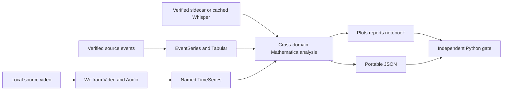
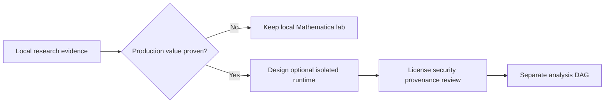

# Mathematica leverage roadmap

## Direction

Exhaust the analytical and authoring value of Mathematica locally before
introducing orchestration, storage, or cloud complexity. The implemented local
media lab is the foundation; Python remains only the independent trust boundary.

## Foundation — implemented and verified

The current v2 branch now provides:

- the `Local-prototype/{ingest,transcripts,models,artefacts,output,logs,work}`
  workspace;
- one-command local execution through
  `scripts/Invoke-MathematicaLocalPrototype.ps1`;
- explicit discovery and recording of an exact Wolfram Language 15+ kernel;
- a canonical executable notebook with visible stage-labelled definitions and
  registered typed exceptions;
- direct Wolfram `Video` and `Audio` import and analysis;
- per-frame color/palette, motion, histogram-distance, and scene-candidate
  measurements;
- dynamics, RMS/peak/loudness, spectral centroid/spread, zero-crossing,
  spectrogram, interval, and fundamental-frequency analysis;
- hash-bound `.txt`, `.srt`, and `.vtt` sidecars plus verified local
  Whisper-V1 Tiny CPU transcription with an explicit cache step and
  deterministic 30-second mono zero-padding;
- transcript statistics and timing-basis-labelled sentence navigation aligned
  with visual and sound measurements on a shared time axis;
- named `TimeSeries`, provenance `EventSeries`, and `Tabular` representations;
- seven hashed Wolfram outputs, including HTML/Markdown reports and an
  interactive code-bearing notebook with native playback, evidence-backed
  observations, transcript search, and one shared frame/audio/speech/scene/event
  cursor;
- strict Python input/evidence preparation and output canonicalization only;
- v2 source/input/result schemas, independent notebook-hash binding, and an
  optional two-run repeatability gate;
- Wolfram unit tests, Python boundary tests, a validated v2 media/Whisper run,
  and historical v1 repeatability/no-audio fallback evidence on Engine 15.0.0
  for Windows x86-64.

## Next — deepen local Mathematica use

Add experiments as separate, versioned analyses rather than optional switches
inside the existing result contract.

1. **Video dynamics:** compare the implemented sampled-frame scene signal with
   feature tracking, stabilization diagnostics, shot-boundary ground truth,
   and richer motion fields before promoting another method.
2. **Audio structure:** build on the implemented pitch/spectral diagnostics
   with frequency-band energy, harmonic confidence, transient segmentation,
   channel comparisons, and interactive interval drill-down.
3. **Cross-modal explanation:** move beyond the implemented shared timeline to
   explicitly tested correlations and candidate events, while preserving each
   source measurement and its limitations.
4. **Transcript quality:** establish representative interview-language test
   sets, word-error measures, human corrections, and a canonical reviewed
   sidecar lifecycle before relying on speech text downstream.
5. **Statistical explanation:** use symbolic/statistical models and
   `ModelFitReport` where they improve interpretation, while recording model
   definitions and producing portable coefficient/diagnostic summaries.
6. **Provenance exploration:** turn richer local evidence into graph and
   temporal views without replacing canonical source/evidence JSON.
7. **Notebook interaction:** build on the implemented native playback and
   linked media cursor with notebook-backed interval comparisons; every
   calculation must remain visible in the canonical notebook.
8. **Text research:** after reviewed transcript artifacts exist, evaluate
   entity/text analysis and semantic retrieval as explicitly identified
   processors.

Every experiment must identify its input bytes, exact kernel and notebook hash,
parameters, outputs, and capabilities used. Cloud functions, implicit model
downloads, LLM calls, and speech services remain off unless introduced as a
separate, reviewable experiment.

## Local adoption gates

A local experiment graduates into the canonical notebook only when:

- it adds a clear analytical or explanatory capability;
- reruns evaluate the same tagged cells carried into the generated notebook;
- outputs are portable and independently hash-verifiable;
- failures are typed and no partial result is canonicalized;
- a new wire shape receives a new schema/analysis version;
- the exact Wolfram runtime and dependencies are recorded.

## Deferred — operational integration

Airflow scheduling, MinIO publication, container images, OpenLineage emission,
MCP serving, and unattended licensing are future decisions, not work required
for the current local lab. If local evidence later justifies productionization,
the first operational step is a separately triggered optional analysis DAG;
Wolfram must never become a prerequisite for successful ingestion.

