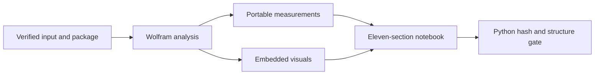

# Mathematica notebook sections

`output/analysis-notebook.nb` is a generated review surface backed by the same
`BabelaphaAnalysis` package as the headless runner. It does not contain a
second analysis implementation. The v2 result gate requires the named
analytical sections and at least five embedded graphics before it accepts the
notebook.

The eleven top-level sections are:

1. **Executive overview** — six KPI cards for duration, sampled frames, audio,
   loudness, audible share, and transcript status.
2. **Source and runtime** — source, object/run identity, Wolfram runtime,
   package hash, network mode, and analysis parameters.
3. **Video storyboard** — all twelve uniformly sampled frames with shared-clock
   timestamps plus the Wolfram video summary.
4. **Color analysis** — dominant palette, RGB and brightness trajectories,
   saturation, contrast, and colorfulness measurements.
5. **Motion and temporal structure** — adjacent-frame motion,
   color-histogram distance, and thresholded scene-change candidates.
6. **Sound intelligence** — waveform, RMS/peak/loudness curves, spectral
   centroid and spread, zero-crossing rate, pitch candidates, spectrogram, and
   audible/silent intervals.
7. **Transcript and speech text** — verified Whisper or sidecar content,
   timestamped segments, statistics, and an explicit reason when unavailable.
8. **Cross-modal timeline** — brightness, motion, audio activity, RMS,
   loudness, scene markers, and transcript coverage on one media-time axis.
9. **Provenance and evidence** — source/evidence/package identity, ordered
   evidence-event summary, and the output inventory.
10. **Capabilities and methodology** — `USED`, `UNAVAILABLE`, or
    `NOT_APPLICABLE` status with reasons, followed by method and limitation
    notes.
11. **Re-run through the verified package** — an input cell that calls the
    same package entry point and analysis input used by the launcher.

`Output inventory` is a subsection of provenance in the notebook expression
and is also a required marker at the validation boundary. Empty transcript or
audio lanes remain visible and explain why data is unavailable; they are not
silently converted to zero-valued observations.
