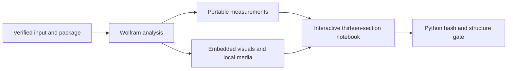

# Mathematica notebook sections

`output/analysis-notebook.nb` is a generated review surface backed by the same
`BabelaphaAnalysis` package as the headless runner. It does not contain a
second analysis implementation. The v2 result gate requires the named
analytical sections, embedded graphics, native dynamic controls, an executable
initialization cell, truthful transcript status/method markers, and
`Default.nb` styling before it accepts the notebook. A static report renamed to
`.nb` no longer passes validation.

The thirteen top-level sections are:

1. **Executive overview** — six KPI cards for duration, sampled frames, audio,
   loudness, audible share, and transcript status.
2. **What this run shows** — deterministic observations and limitations with
   the exact result paths that support every statement.
3. **Linked media explorer** — one animated/clickable media-time cursor driving
   the nearest sampled frame and audio measurement plus the active RMS activity
   region, speech text, visual scene, and nearest cross-modal event. The native
   local-video player is loaded on demand and is explicitly independent of the
   analytical cursor because its saved control has no stable seek binding.
4. **Source and runtime** — source, object/run identity, Wolfram runtime,
   package hash, network mode, and analysis parameters.
5. **Video storyboard** — the full static contact sheet and Wolfram video
   summary; interactive playback and frame inspection live in the linked
   explorer instead of a second disconnected widget.
6. **Color analysis** — dominant palette, RGB and brightness trajectories,
   saturation, contrast, and colorfulness measurements.
7. **Motion and temporal structure** — adjacent-frame motion,
   color-histogram distance, and thresholded scene-change candidates.
8. **Sound intelligence** — waveform, RMS/peak/loudness curves, spectral
   centroid and spread, zero-crossing rate, pitch candidates, spectrogram,
   audible/silent intervals, and the numeric details behind the linked selector.
9. **Transcript and speech text** — the exact emitted status, method, reason,
   model/sidecar source, statistics, content, timestamped source segments, and
   clearly labelled estimated sentence-navigation timing.
10. **Cross-modal timeline** — brightness, motion, audio activity, RMS,
    loudness, scene markers, and transcript coverage on the same media-time axis
    used by the linked cursor.
11. **Provenance and evidence** — source/evidence/package identity, ordered
   evidence-event summary, and the output inventory.
12. **Capabilities and methodology** — `USED`, `UNAVAILABLE`, or
    `NOT_APPLICABLE` status with reasons, followed by method and limitation
    notes.
13. **Re-run through the verified package** — an input cell that calls the
    same package entry point and analysis input used by the launcher.

`Output inventory` is a subsection of provenance in the notebook expression
and is also a required marker at the validation boundary. Empty transcript or
audio lanes remain visible and explain why data is unavailable; they are not
silently converted to zero-valued observations.

The notebook uses Mathematica's standard `Default.nb` styles. The explorer is
one self-contained `DynamicModule` with a slider, animator, timeline click
handler, event/scene jump selector, audio-metric selector, numeric time input,
and transcript search. Editable setup and rerun cells use normal executable
`Input` boxes. The video player deliberately references the local file under
`ingest/`, so moving or deleting that source breaks playback without changing
the hash-bound analytical result.
