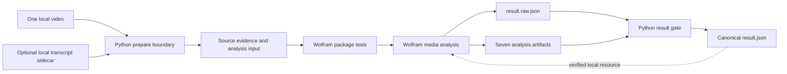

# Implemented v2 local Mathematica media lab

## Objective and verified baseline

The pilot is now a runnable, local-only media laboratory rather than a design
for a future Airflow task. Version 2 exercises Wolfram Language directly over
one local video, adds rich visual/sound/transcript analysis, and retains
portable, independently verified outputs.

The package requires Wolfram Language 15 or newer. The completed reference run
used **Wolfram Engine 15.0.0 for Microsoft Windows (64-bit)** on
`Windows-x86-64`. The launcher records the exact runtime in
`Local-prototype/artefacts/runtime.json` for every run.

## Run it

```powershell
New-Item -ItemType Directory -Force .\Local-prototype\ingest | Out-Null
Copy-Item C:\path\to\video.mp4 .\Local-prototype\ingest\
.\scripts\Invoke-MathematicaLocalPrototype.ps1
```

The ingest directory must contain exactly one supported video. Use
`-PreflightOnly` to inspect the selected kernel without changing the workspace,
or pass `-WolframKernelPath` to select an installed kernel explicitly.

```text
Local-prototype/
  ingest/       one user-supplied video
  transcripts/  optional .txt, .srt, or .vtt transcript sidecar
  models/       reserved workspace-local model manifests or exports
  artefacts/    source evidence, analysis input, and runtime identity
  output/       raw/canonical JSON, plots, reports, and notebook
  logs/         combined launcher, Python, and Wolfram logs
  work/         reserved scratch space for later local experiments
```

All runtime-content directories are ignored by Git. The workspace guide is
[Local-prototype/README.md](../../Local-prototype/README.md).

The default `prefer_sidecar` mode selects a matching verified sidecar first
and otherwise runs the pinned Whisper model. Use `automatic`, `sidecar`, or
`disabled` to require the other explicit behaviors. Before the first automatic
run, perform the only network-enabled step deliberately:

```powershell
.\scripts\Invoke-MathematicaLocalPrototype.ps1 -PrepareSpeechModelOnly
```

That command acquires the Wolfram `Whisper-V1 Nets` Tiny resource and then
verifies its pinned UUID, version, component sizes, and SHA-256 identities.
Normal analysis sets Wolfram internet access to false and will report the
transcript capability as unavailable rather than download implicitly.

## Execution flow



The PowerShell launcher always invokes `wolframscript -local` with the exact
discovered kernel path. It does not change global WolframScript configuration
and does not start Docker, Airflow, MinIO, Pachyderm, or a cloud service.

## Implementation shape

```text
prototype/mathematica/
  BabelaphaAnalysis/Kernel/
    init.wl
    ErrorMapping.wl
    InputValidation.wl
    EvidenceAdapter.wl
    MediaAnalysis.wl
    TranscriptAnalysis.wl
    ResultExport.wl
    PublicAPI.wl
  analyze.wls
  cache-whisper-model.wls
  local_boundary.py
  tests/
    BabelaphaAnalysisTests.wlt
    run-tests.wls
```

- `init.wl` initializes the Version 15 Structured Package Format package with
  `PackageInitialize`.
- Registered exception types distinguish invalid input, integrity,
  dependencies, analysis runtime, and export failures.
- `analyze.wls` is a thin CLI over the exported package function. The generated
  notebook calls that same package and contains no private calculation path.
- `local_boundary.py` is dependency-free Python and owns only source identity,
  strict contracts, safe paths, output rehashing, and canonical JSON.

## Mathematica workload

The package opens the source directly as a Wolfram `Video`, samples twelve
uniform frames, and constructs a named `TimeSeries` for brightness and
mean-absolute grayscale frame difference. It calculates frame dimensions,
mean RGB, brightness, saturation, contrast, colorfulness, a deterministic
quantized palette, color-histogram distance, motion summaries, and scene-change
candidates, then exports a contact sheet and `VideoSummaryPlot` result.

For videos with a decodable audio track, Wolfram extracts `Audio[video]` and
uses `AudioMeasurements`, `AudioLocalMeasurements`, `AudioIntervals`,
`AudioPlot`, and `Spectrogram`. Results include sample rate, channel count,
duration, RMS/peak amplitude, EBU loudness, crest factor, local dynamic range,
audible and silent intervals, RMS distributions, spectral centroid/spread,
zero-crossing rate, and fundamental-frequency candidates. Local observations
are combined into named-component `TimeSeries` values.

Transcript analysis either parses a verified `.txt`, `.srt`, or `.vtt`
sidecar, or performs greedy CPU inference with the verified cached Wolfram
Whisper-V1 Tiny encoder, decoder, and labels while network access is disabled.
Automatic audio is locally materialized, mixed to mono, split by sample index,
and zero-padded to deterministic 30-second model inputs. The result includes
method, status/reason, text, timestamped segments,
statistics, and model/inference or sidecar provenance. Visual, audio, scene,
and transcript observations are then aligned on one media-time axis.

The verified source events become an `EventSeries` and a `Tabular` object.
These rich Wolfram values remain internal; portable JSON contains their stable
summaries.

## Contracts and artifacts

The Python preparation step writes canonical
`artefacts/source-evidence.json` and `artefacts/analysis-input.json`. Their
current v2 schemas define source and optional transcript-sidecar SHA-256 and
byte size, local object/run identity, the exact Wolfram package SHA-256, fixed
analysis parameters, transcript mode, evidence identity, and the relative
output directory. The run ID changes when the source, sidecar, parameters,
analysis, or package changes. Mathematica independently recomputes the package
hash and rechecks source/evidence/sidecar hashes before analysis.

Wolfram produces `result.raw.json` plus these seven declared outputs:

| Artifact | Purpose |
|---|---|
| `audio-overview.png` | Waveform, RMS, spectral-centroid, and spectrogram review |
| `audio-overview.svg` | Portable vector RMS and spectral-centroid view |
| `video-contact-sheet.png` | Uniformly sampled source frames |
| `video-summary.png` | Wolfram `VideoSummaryPlot` output |
| `report.md` | Portable text report with measurements and capabilities |
| `report.html` | Self-contained local review page referencing the plots |
| `analysis-notebook.nb` | Rich thirteen-section review notebook, linked media cursor, and shared-package rerun cell |

Python then validates exact keys and types, rejects duplicate/nonfinite JSON,
ensures every output is a direct child of `output/`, checks the exact seven-file
set and media types, recomputes every size and SHA-256, and writes canonical
`result.json` with `SORTED_INDENTED_JSON_V1`.

The current contracts are:

- `mathematica-local-source-evidence-v2.schema.json`;
- `mathematica-local-analysis-input-v2.schema.json`;
- `mathematica-local-analysis-result-v2.schema.json`.

The v1 schemas remain immutable for historical readers. They describe the
smaller original media pilot and are superseded by v2 rather than edited or
deleted. See [the contract inventory](../../contracts/README.md) for the exact
boundary and [the notebook map](notebook-sections.md) for the review surface.

## Failure and acceptance behavior

| Condition | Behavior |
|---|---|
| Missing, multiple, or unsupported ingest files | Launcher/boundary fails before Wolfram analysis |
| Invalid input or unsafe relative path | Typed input failure, exit code 10 |
| Source/evidence identity mismatch | Typed integrity failure, exit code 11 |
| Required Wolfram capability unavailable | Typed dependency failure, exit code 12 |
| Media analysis or export failure | Typed runtime/export failure, exit code 20 |
| Invalid raw result or output hash | Python rejects it and does not write canonical `result.json` |

The validated v2 reference run passed twenty Wolfram package tests, direct video
and audio analysis, all extended color/motion/sound measurements, local
Whisper-V1 Tiny CPU transcription with three verified model components,
seven-artifact export, and independent Python canonicalization. Its processor
record reports `network_mode: disabled`, and every v2 core capability is
`USED`. Sidecar discovery and SHA-256 binding are covered at the Python
boundary, and Wolfram rejects missing, altered, or out-of-range selected
sidecars before analysis. V2 also completed a two-run byte-for-byte
repeatability gate and a separate no-audio fallback run with explicit
`UNAVAILABLE`/`NOT_APPLICABLE` evidence rather than fabricated measurements.

Further local experiments should preserve these contracts or introduce a new
versioned `analysis_id` and schemas.
