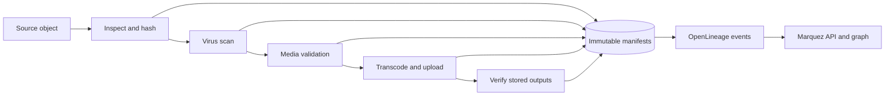

# Pipeline transparency

Babelapha records one immutable provenance manifest for every Airflow task
attempt. Airflow remains the operational view, MinIO/Pachyderm stores the
evidence, and Marquez renders the OpenLineage graph.



## Canonical record

The schema is [`contracts/provenance-manifest-v1.schema.json`](../contracts/provenance-manifest-v1.schema.json).
The immutable object key is:

```text
provenance/<object-id>/<dag-run-id>/<task-id>/<attempt>-<status>.json
```

Every record carries:

- the object ID and filename;
- Airflow DAG, run, task, attempt, status, timing, and log URL;
- an explicit decision outcome, machine-readable reason code, and message;
- input and output URIs, SHA-256 values, byte sizes, S3 version IDs, ETags,
  and optional Pachyderm commit IDs;
- repository commit, exact DAG-file SHA-256, configured image, and registry
  digest when available.

`reports/<object-id>/*.json` files are mutable operational summaries retained
for compatibility. They are not the provenance source of truth.

## Failure and retry semantics

Successful, failed, and retrying attempts use different immutable keys. A
retry therefore preserves the failed attempt instead of overwriting it. The
Airflow callbacks never overwrite a non-identical existing record. Both the
local and production DAGs end with a `verify_provenance` task; a successful
pipeline cannot pass that gate when any required upstream success manifest is
missing.

The write uses the S3 `If-None-Match: *` precondition, so append-only behavior
is atomic even when duplicate callbacks race. Re-emitting identical bytes is
idempotent; conflicting bytes are rejected.

## Exact identity

Artifacts are marked `VERIFIED` only when their bytes were hashed. MinIO object
versioning is enabled by the local stack, and transcoded objects carry their
SHA-256 in S3 metadata before they are read back and verified.

Container identity is deliberately honest:

- `image@sha256:<digest>` produces `VERIFIED_DIGEST`;
- a mutable tag such as `localhost/transcode:latest` produces
  `CONFIGURED_REF_ONLY`.

For production, set these variables to digest-pinned references:

```text
BABELAPHA_SCAN_IMAGE=registry.example/clamav@sha256:<64 hex>
BABELAPHA_VALIDATE_IMAGE=registry.example/validate@sha256:<64 hex>
BABELAPHA_TRANSCODE_IMAGE=registry.example/transcode@sha256:<64 hex>
```

For local Airflow, inject the result of `docker image inspect` as
`BABELAPHA_RUNTIME_IMAGE_DIGEST` when exact container reproduction is required.
Set `BABELAPHA_GIT_SHA` to the full 40- or 64-character commit SHA. Short or
symbolic refs are not accepted as exact identities. The DAG-file SHA-256 remains
exact even in an uncommitted local working tree.

## OpenLineage and Marquez

The same manifest identity, artifact edges, decision, Git commit, and container
digest are emitted to:

```text
POST http://marquez:5000/api/v1/lineage
```

The Compose stack exposes:

- Airflow: <http://localhost:8080>
- MinIO console: <http://localhost:9001>
- Marquez API: <http://localhost:5000>
- Marquez lineage UI: <http://localhost:3001>

Run the contract tests and configuration check with:

```powershell
python -m unittest discover -s tests -v
docker compose config --quiet
```

The future public explorer should query these canonical records. It must not
create a second status model or infer provenance from logs.
