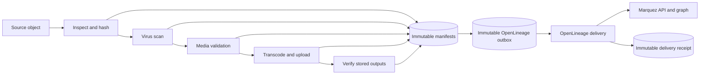

# Pipeline transparency

Babelapha records one immutable provenance manifest for every Airflow task
attempt. Airflow remains the operational view, MinIO/Pachyderm stores the
evidence, and Marquez renders the OpenLineage graph.



## Canonical record

The schema is [`contracts/provenance-manifest-v1.schema.json`](../contracts/provenance-manifest-v1.schema.json).
The immutable object key is:

```text
provenance/<object-id>/<dag-run-id>/<task-id>/<attempt>-<status>.json
```

Every record carries:

- the object ID and filename;
- Airflow DAG, run, task, attempt, status, timing, and log URL;
- an explicit decision outcome, machine-readable reason code, and message;
- input and output URIs, SHA-256 values, byte sizes, S3 version IDs, ETags,
  and optional Pachyderm commit IDs;
- repository commit, exact DAG-file SHA-256, configured image, and registry
  digest when available.

`reports/<object-id>/*.json` files are mutable operational summaries retained
for compatibility. They are not the provenance source of truth.

## Failure and retry semantics

Successful, failed, and retrying attempts use different immutable keys. A
retry therefore preserves the failed attempt instead of overwriting it. The
Airflow callbacks never overwrite a non-identical existing record. Every
shipped ingestion DAG ends with a `verify_provenance` task; a successful
pipeline cannot pass that gate when any required upstream success manifest is
missing, malformed, stored under the wrong identity key, or lacks its exact
canonical OpenLineage outbox event. The gate validates manifest contents and
proves the queued execution and artifact facts match before declaring the run's
provenance complete.

`ingest_pipeline_v2` is an experimental Kubernetes boundary diagnostic, not a
media-processing path. It still emits and gates the same immutable evidence,
but its decisions say `diagnostic_only`, its artifact outputs are empty, and it
never claims malware, format, or rendition results that it did not measure.

The write uses the S3 `If-None-Match: *` precondition, so append-only behavior
is atomic even when duplicate callbacks race. Re-emitting identical bytes is
idempotent; conflicting bytes are rejected.

## Exact identity

Artifacts are marked `VERIFIED` only when their bytes were hashed. MinIO object
versioning is enabled by the local stack, and transcoded objects carry their
SHA-256 in S3 metadata before they are read back and verified.

Container identity is deliberately honest:

- `image@sha256:<digest>` produces `VERIFIED_DIGEST`;
- a mutable tag such as `localhost/transcode:latest` produces
  `CONFIGURED_REF_ONLY`.

Every Kubernetes DAG fails its first task before launching a pod when a
configured image is not pinned directly in its Kubernetes image reference. For
the production media DAG this covers scan, validation, and transcode; for the
diagnostic DAG it covers its shared Python image. A separate environment
variable cannot upgrade a mutable pod tag to verified identity, because that
would not prove which bytes Kubernetes actually pulled. Conflicting or
malformed configured digests are rejected.

For production, set these variables to digest-pinned references:

```text
BABELAPHA_SCAN_IMAGE=registry.example/clamav@sha256:<64 hex>
BABELAPHA_VALIDATE_IMAGE=registry.example/validate@sha256:<64 hex>
BABELAPHA_TRANSCODE_IMAGE=registry.example/transcode@sha256:<64 hex>
BABELAPHA_DIAGNOSTIC_IMAGE=registry.example/python@sha256:<64 hex>
```

For local Airflow, inject the result of `docker image inspect` as
`BABELAPHA_RUNTIME_IMAGE_DIGEST` when exact container reproduction is required.
That digest applies only to tasks executing inside the Airflow container. A
Kubernetes pod task never inherits it: the pod image must contain its own
`@sha256:` digest. Otherwise it remains honestly marked
`CONFIGURED_REF_ONLY`; the production preflight then prevents it from running.
Set `BABELAPHA_GIT_SHA` to the full 40- or 64-character commit SHA. Short or
symbolic refs are not accepted as exact identities. The DAG-file SHA-256 remains
exact even in an uncommitted local working tree. The production DAG sync also
writes the validated CI commit to `.babelapha-git-sha` beside the deployed DAGs,
so a copied DAG retains its exact Git identity even when the Airflow pod does
not contain the repository metadata.

## Production runtime wiring

The Airflow scheduler, workers, triggerer, and webserver must receive the same
runtime configuration. Keep credentials in Kubernetes Secrets and the
non-secret values in the Airflow deployment configuration:

| Variable | Production value |
|---|---|
| `S3_BUCKET`, `MINIO_ENDPOINT` | Source/output bucket and its S3-compatible endpoint |
| `MINIO_ACCESS_KEY`, `MINIO_SECRET_KEY` | Kubernetes Secret required by the production DAG |
| `PROVENANCE_S3_BUCKET` | Versioned bucket containing the canonical records |
| `PROVENANCE_S3_ENDPOINT` | Pachyderm/MinIO S3-compatible API endpoint |
| `AWS_ACCESS_KEY_ID`, `AWS_SECRET_ACCESS_KEY` | Optional separate Secret with write access to the provenance prefix |
| `OPENLINEAGE_URL` | Marquez API base URL |
| `OPENLINEAGE_ENDPOINT` | `/api/v1/lineage` |
| `OPENLINEAGE_NAMESPACE` | Stable environment name such as `babelapha-production` |
| `BABELAPHA_*_IMAGE` | Registry references pinned with `@sha256:` |

The sync job refuses a missing, short, or symbolic `BUILD_VCS_NUMBER`.
Kubernetes DAGs refuse container references without a digest before launching
a pod. The local DAG can still run without a known runtime digest, but its
manifests are explicitly marked `CONFIGURED_REF_ONLY` rather than exact.

The Pachyderm webhook contract also fails closed when a commit ID is missing.
It copies that exact ID into `dag_run.conf.pachyderm_commit` and derives a stable
run ID from the commit plus object identity, so a redelivered event resolves to
the same Airflow run instead of creating duplicate lineage.

## OpenLineage and Marquez

The same manifest identity, run/stage/attempt/status/timing, decision, Git and
DAG identity, container identity, orchestration details, and artifact evidence
are emitted to OpenLineage. Every input and output dataset carries its SHA-256,
byte size, media type, integrity state, Pachyderm commit, S3 version, and ETag in
the versioned `babelapha_artifact` input/output facet. Placing this evidence in
`inputFacets` and `outputFacets` preserves it on the dataset version associated
with that exact run. Schema URLs are pinned to the exact contract commit rather
than the mutable default branch.

Events are sent to:

```text
POST http://marquez:5000/api/v1/lineage
```

Each callback stores the canonical manifest and the exact serialized
OpenLineage event before attempting HTTP delivery. A successful 2xx response
creates a separate receipt containing the event SHA-256 and endpoint. If
Marquez is unavailable, the manifest and outbox event remain intact and the
missing receipt makes the pending state explicit.

Inspect pending delivery without changing anything, then replay it:

```powershell
docker compose run --rm provenance-replay --object-id <object-id> --dry-run
docker compose run --rm provenance-replay --object-id <object-id>
```

Use `--manifest-id <uuid>` for one exact task attempt. The replay command sends
the immutable queued event; it never rebuilds an event from current code. It
validates existing receipts against the queued bytes and refuses to treat a
corrupt or mismatched receipt as delivered. In production, run
`pipelines/airflow/replay_openlineage.py` with the same provenance S3 and
OpenLineage environment variables used by Airflow.

The Compose stack exposes:

- Airflow: <http://localhost:8080>
- MinIO console: <http://localhost:9001>
- Marquez API: <http://localhost:5000>
- Marquez lineage UI: <http://localhost:3001>
- Read-only provenance API: <http://localhost:8010/api/v1/media>

Discover canonical media IDs, then select one item and inspect every recorded
run, stage decision, failure,
artifact hash, storage version, Pachyderm commit, Git commit, DAG hash, and
container digest with:

```powershell
docker compose run --rm provenance-inspect --list-objects
docker compose run --rm provenance-inspect --object-id <object-id>
```

The versioned read-only HTTP boundary exposes the same operations for the
future explorer without giving a browser direct MinIO credentials:

```text
GET /health
GET /ready
GET /api/v1/openapi.json
GET /api/v1/media?limit=50&cursor=<opaque-token>
GET /api/v1/media/<percent-encoded-object-id>?run_id=<run-id>
```

Its JSON detail response is produced by the same strict manifest,
OpenLineage-event, and delivery-receipt validation used by the CLI. It does not
write status, query Airflow, or infer results from logs. CORS is disabled by
default; local origins can be explicitly allowlisted with the comma-separated
`PROVENANCE_API_ALLOWED_ORIGINS` value. This Compose service is a development
read boundary, not an internet security perimeter; add authentication, rate
limiting, and deployment-specific authorization before public exposure.

The API runs in its own non-root image rather than inheriting the Airflow
runtime. Its Python base is digest-pinned, every Python dependency is version
pinned, and CI supplies the full Git commit as the OCI image revision:

```powershell
docker build --pull `
  --build-arg BUILD_VCS_NUMBER=$(git rev-parse HEAD) `
  -f docker/provenance-api/Dockerfile `
  -t babelapha-provenance-api:local .
```

A production deployment should promote the built image by registry digest,
not by its mutable local tag.

The same view joins each manifest to its immutable OpenLineage outbox event and
delivery receipt. It reports `DELIVERED`, `PENDING`, `MISSING_OUTBOX`,
`ORPHANED_RECEIPT`, or `INTEGRITY_ERROR`, together with the exact event SHA-256,
receipt, accepting endpoint, HTTP status, and delivery time. A queued event is
marked verified only when all of its execution and artifact facts match the
canonical manifest.

For each shipped DAG, new callbacks embed the ordered DAG task contract and its
SHA-256 in every manifest. The same contract is mirrored into OpenLineage as an
execution parameter. The inspector prefers this immutable, run-era topology
and reports whether every record carries it (`COMPLETE`) or only part of the
run does (`PARTIAL`). Legacy runs remain readable through an explicitly marked
`CURRENT_REGISTRY_FALLBACK`; that fallback is not represented as historical
proof and may drift if the DAG later changes. Unknown DAG IDs are shown with an
unknown contract instead of being judged against a current pipeline.

The view reports both the recorded task count and every expected task with
`No immutable execution record`. This makes downstream absence visible on
failed runs without inventing an Airflow state: absence of callback evidence
alone does not prove that a task was skipped or marked upstream-failed.

The inspector exits with code `3` for missing or inconsistent delivery
evidence. Add `--require-delivered` in CI or an operational check to also return
code `4` while any valid event remains pending.

Restrict the view to one Airflow run or return machine-readable JSON:

```powershell
docker compose run --rm provenance-inspect --object-id <object-id> --run-id <run-id>
docker compose run --rm provenance-inspect --object-id <object-id> --format json
```

Run the contract tests and configuration check with:

```powershell
python -m unittest discover -s tests -v
docker compose config --quiet
```

The future public explorer should query this read-only API. It must not create
a second status model or infer provenance from logs.
