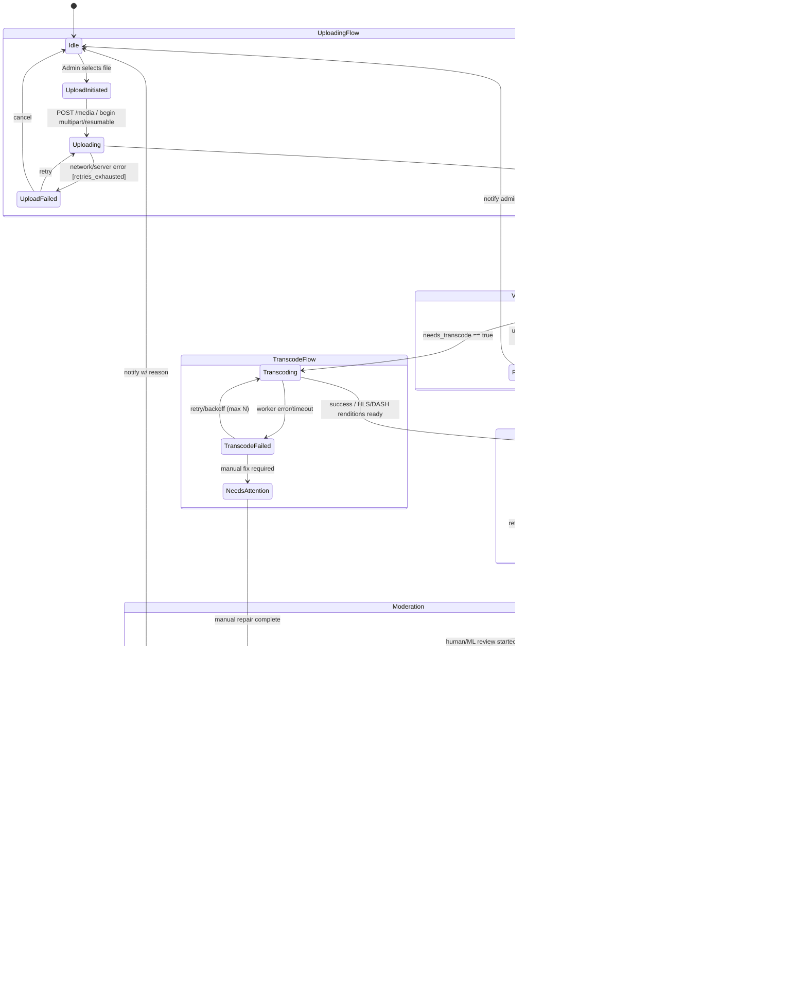

```mermaid
stateDiagram-v2
    [*] --> Idle

    Idle --> UploadInitiated : Admin selects file
    state UploadingFlow {
        UploadInitiated --> Uploading : POST /media / begin multipart/resumable
        Uploading --> UploadFailed : network/server error [retries_exhausted]
        Uploading --> Uploaded : 201 Created / object in temp bucket
        UploadFailed --> Uploading : retry
        UploadFailed --> Idle : cancel
    }

    Uploaded --> VirusScan : object_created event
    VirusScan --> Quarantined : result = infected
    VirusScan --> Validation : result = clean

    state ValidationFlow {
        Validation --> Rejected : unsupported || too_long || corrupted
        Validation --> Transcoding : needs_transcode == true
        Validation --> AssetAssemble : needs_transcode == false
    }

    state TranscodeFlow {
        Transcoding --> TranscodeFailed : worker error/timeout
        Transcoding --> AssetAssemble : success / HLS/DASH renditions ready
        TranscodeFailed --> Transcoding : retry/backoff (max N)
        TranscodeFailed --> NeedsAttention : manual fix required
    }

    state AssetBuild {
        AssetAssemble --> Thumbnailing : generate keyframes/poster
        Thumbnailing --> ThumbFailed : extractor error
        Thumbnailing --> MetadataExtract : success
        ThumbFailed --> Thumbnailing : retry/backoff
        MetadataExtract --> ModerationQueue : store tech+content metadata
    }

    state Moderation {
        ModerationQueue --> UnderReview : human/ML review started
        UnderReview --> Blocked : policy_violation == true
        UnderReview --> ReadyToPublish : cleared
        ModerationQueue --> ReadyToPublish : auto-clear policy
    }

    ReadyToPublish --> Publishing : Admin clicks "Publish"
    Publishing --> PublishFailed : db/cdn error
    Publishing --> Published : success

    Published --> CDNPropagation : warm edges, purge old
    CDNPropagation --> Live : edges warmed

    Live --> Archived : admin archives
    Live --> Takedown : rights strike / admin takedown
    Quarantined --> Deleted : confirmed malicious
    Rejected --> Idle : notify admin
    Blocked --> Idle : notify w/ reason
    PublishFailed --> ReadyToPublish : retry after fix
    NeedsAttention --> ReadyToPublish : manual repair complete

    Archived --> [*]
    Deleted --> [*]
    Takedown --> [*]

```